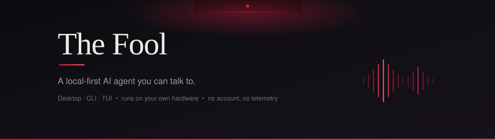
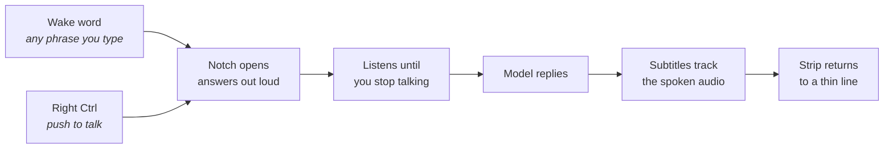
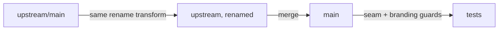

<p align="center">
  
</p>

<p align="center">
  <a href="LICENSE"></a>
  
  
  
</p>

---

An AI agent that lives on your machine: it reads and writes your files, runs
commands, browses, remembers, and — when you want it to — listens and talks
back. The model runs on your own hardware through LM Studio, so there is no
account to make, no key to paste, and no per-token bill.

It is a fork of [Hermes Agent](https://github.com/NousResearch/hermes-agent),
which is excellent and MIT-licensed. What follows is an honest account of what
this fork changes and why you might want it.

## Why this instead of Hermes

Three things, and only three. Everything else is upstream's work and stays that
way.

| | Hermes Agent | The Fool |
|---|---|---|
| **Model** | Cloud providers first; local works if you configure it | Local first. Probes LM Studio, Ollama, Jan, llama.cpp, vLLM and adopts what it finds — no provider picker, no base URL, no model id to copy |
| **Voice** | Text interface | A voice surface built into the desktop: wake word, push-to-talk, live subtitles |
| **On first launch** | Fetches the model catalog; diagnostics upload available | Catalog ships with the release. Diagnostics off. Nothing leaves the machine unless you point it somewhere |

Remote providers still work. OpenRouter, Anthropic, OpenAI, anything
OpenAI-compatible — the whole provider layer is intact, and you can reach for it
whenever local weights aren't enough.

The two installs coexist. Separate application id, separate data directory,
separate update channel. Running this will not touch an existing Hermes config,
session history, or memory.

## The voice surface

This is the part that doesn't exist upstream, so it's worth a closer look.

A thin strip sits at the top edge of your screen. It stays out of the way until
you talk to it.



**Wake word, in your own words.** Type any phrase. Open-vocabulary keyword
spotting recognises it with no training and no model to fine-tune. Three
detection engines are supported; the ones that need extra packages install
themselves from the settings panel, and one that isn't installed is never
offered as if it worked.

**Subtitles that track the audio, not a timer.** The strip reveals the sentence
as it is actually being spoken, paced from the audio clock rather than an
estimated words-per-minute. It widens to fit the sentence and shrinks back when
the turn ends.

**Push-to-talk that behaves.** Hold the key, speak, release. Nothing is captured
while the key is up.

Speech recognition and synthesis both run locally. Engines are downloaded from
the app, on request, and the large ones stay optional — see
[optional voice engines](docs/fool/OPTIONAL-VOICE-ENGINES.md) for the ones whose
licences prevent redistribution.

## Two modes

**Cowork** is the full agent: tools, terminal, files, browser, delegation.

**Chat** is the same model with the machine put away: it can read files, search
the web, look at images and recall past sessions — but it cannot run a command,
write a file or drive a browser. It answers faster because it isn't carrying a
toolbox it doesn't need.

You switch per session, and the choice is remembered with the session rather
than applied globally.

## Requirements

- **[LM Studio](https://lmstudio.ai)** with a **tool-calling capable** model
  loaded. This matters: the agent edits files and runs commands, and a model
  without tool calling can only hold a conversation.
- Roughly **16 GB of VRAM** for a comfortable 9B-class model. Less works with a
  smaller model.

Python and Node are **not** prerequisites. The installer brings its own. You
need them only to build from source.

## Install

```powershell
# Windows — PowerShell
irm https://raw.githubusercontent.com/zaorenn/fool-agent/main/scripts/install.ps1 | iex
```

```bash
# macOS / Linux
curl -fsSL https://raw.githubusercontent.com/zaorenn/fool-agent/main/scripts/install.sh | bash
```

Open a **new** terminal afterwards — PATH changes only reach shells started
after the install — then:

```bash
fool --help      # confirms the install
fool             # chat in the terminal
fool desktop     # build and launch the desktop app
```

The first `fool desktop` compiles the app and takes a few minutes. After that it
launches immediately, and only rebuilds when something actually changed.

To update both the terminal agent and the desktop app:

```bash
fool update
```

## First run

There is nothing to configure. The Fool probes these endpoints and adopts the
first one that answers:

| Runner | Endpoint |
|---|---|
| LM Studio | `127.0.0.1:1234` |
| Ollama | `127.0.0.1:11434` |
| Jan | `127.0.0.1:1337` |
| llama.cpp | `127.0.0.1:8080` |
| vLLM | `127.0.0.1:8000` |
| text-generation-webui | `127.0.0.1:5000` |

An existing provider choice is never overwritten. To set one by hand, edit
`~/.fool/config.yaml`:

```yaml
model:
  default: "qwen/qwen3.5-9b"   # must match the runner's /v1/models id
  provider: "lmstudio"
```

Running the model on a second machine works the same way — point the config at
its address. See [SECOND-MACHINE.md](docs/fool/SECOND-MACHINE.md).

## How this fork stays alive

Most forks die the same way. The rebrand touches every file, every upstream
merge conflicts everywhere, merging quietly stops, and the fork rots a release
behind.

This one is built so that can't happen.



**The rename is a transform, not an event.** `hermes_cli` → `fool_cli`,
`HERMES_*` → `FOOL_*`, `~/.hermes` → `~/.fool`, and the compound identifiers
throughout. It is deterministic and idempotent, so the same transform is applied
to a copy of upstream before merging. Conflicts then arise only from real
content differences, never from names. A month of upstream drift touches 2,776
files; after the transform, almost none of them conflict.

**Branding is applied at load time**, not by editing strings. The i18n catalog,
argparse help, command descriptions, skill metadata and tool schemas all pass
through one transformer. When upstream adds new text, it arrives already
rebranded. Maintenance cost stays flat instead of growing with the surface.

**The places upstream code is touched are counted.** Each one carries a
`FOOL-SEAM:` marker and a test that fails loudly if a merge ever swallows it —
because the dangerous merge conflict isn't the one you resolve, it's the one
that resolves itself in upstream's favour without telling you.

```bash
git fetch upstream
git checkout -B upstream-renamed upstream/main
python -m fool.rename --apply
git checkout main && git merge upstream-renamed
python -m pytest tests/fool -q     # seam + branding guards
python -m fool.audit               # anything Hermes left on a visible surface
```

Details: [ARCHITECTURE.md](docs/fool/ARCHITECTURE.md) ·
[UPSTREAM.md](docs/fool/UPSTREAM.md) · [SEAMS.md](docs/fool/SEAMS.md)

## Building from source

```bash
git clone https://github.com/zaorenn/fool-agent.git
cd fool-agent

uv venv .venv --python 3.13
uv pip install --python .venv -e ".[dev]"
npm install

.venv/bin/fool --help                      # CLI  (Scripts\fool on Windows)
npm run dev --workspace apps/desktop       # desktop, hot reload
```

> `npm install` without `--workspace`. A workspace-scoped install prunes the
> other workspaces' packages and breaks the build in a way that looks unrelated.
> [DEVELOPMENT.md](docs/fool/DEVELOPMENT.md) has the rest of the sharp edges.

## Credit

The agent loop, the skill system, the memory architecture and the desktop shell
are [Nous Research](https://github.com/NousResearch)'s work, released under MIT.
This fork changes the defaults, the surface and the name. It does not change the
engineering underneath, and it would not exist without it.

**Not affiliated with or endorsed by Nous Research.** If you want the original,
go upstream — it is very good.

## License

MIT. See [LICENSE](LICENSE); upstream copyright is retained alongside this
fork's own.
